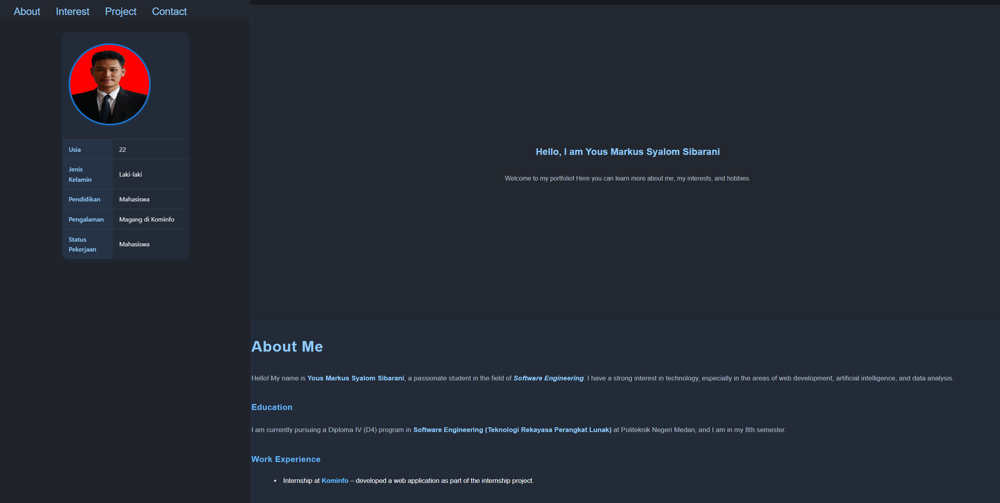

# Personal Portfolio - Yous Markus Syalom Sibarani

## Overview

This website serves as a personal portfolio showcasing my education, skills, interests, and contact information.

## Features

- Layout with sidebar profile
- Semantic HTML structure
- Contact form with validation

## Website Sections

- **Home**  
  A welcoming introduction that briefly describes who I am and what visitors can expect from this website.

- **About Me**  
  Detailed profile including my education, internship experience, and my technical skills

- **Interests**  
  A summary of my passions. I also mention my hobbies like reading comics and gaming.

- **Projects**  
  A list of sample projects I've worked on.

- **Contact**  
  A working HTML contact form where users can send their name, email, and message directly.

## Technologies Used

- HTML5
- CSS3
- VsCode

## How to Use

1. Clone or download this repository.
2. Open `index.html` in your web browser.

## Live Website

➡️ [https://revou-fsse-jun25.github.io/milestone-1-Yous1705/](https://revou-fsse-jun25.github.io/milestone-1-Yous1705/)

## Screenshot

## Kontak

Email: [youssibarani17@gmail.com](mailto:youssibarani17@gmail.com)
